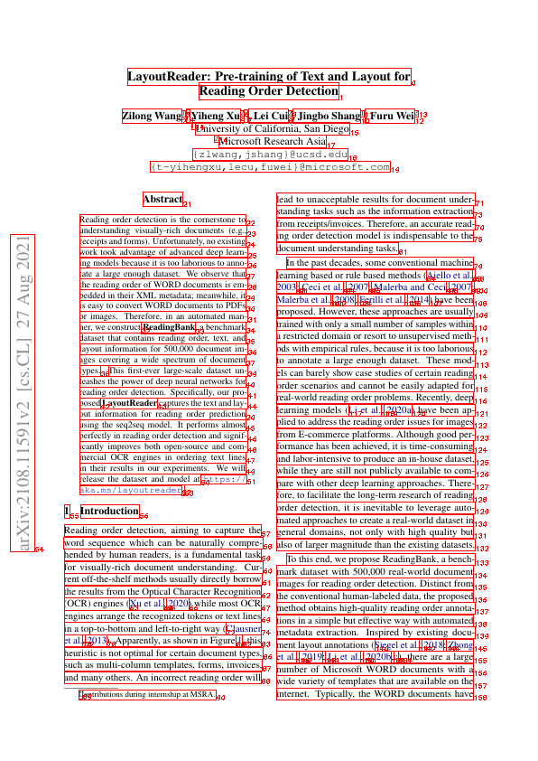
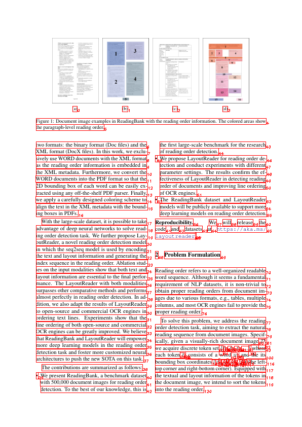

# LayoutReader

<p align="center">
  <a href="https://huggingface.co/hantian/layoutreader">
    
    Model
  </a>
  <a href="https://huggingface.co/datasets/hantian/ReadingBank">
    
    Dataset
  </a>
</p>

<p align="center">
  
  
</p>

✨ Trusted by [MinerU](https://github.com/opendatalab/MinerU) and [MonkeyOCR](https://github.com/Yuliang-Liu/MonkeyOCR).

## Why this repo?

The original [LayoutReader](https://github.com/microsoft/unilm/tree/master/layoutreader) is published by Microsoft Research. It is based on `LayoutLM`, and use a `seq2seq` architecture to predict the reading order of the words in a document. There are several problems with the original repo:
1. Because it doesn't use `transformers`, there are lots of experiments in the code, and the code is not well-organized. It's hard to train and deploy.
2. `seq2seq` is too slow in production, I want to get the all predictions in one pass.
3. The [pre-trained model](https://huggingface.co/nielsr/layoutreader-readingbank)'s input is English word-level, but it's not the real case. The real inputs should be the spans extracted by PDF parser or OCR.
4. I want a multilingual model. I notice only use the bbox is only a little bit worse than bbox+text, so I want to train a model only use bbox, ignore the text.

## What I did?

1. Refactor the codes, use `LayoutLMv3ForTokenClassification` of `transformers` to train and eval.
2. Offer a script turn the original word-level dataset into span-level dataset.
3. Implement a better post-processor to avoid duplicate predictions.
4. Release a [pre-trained model](https://huggingface.co/hantian/layoutreader) fine-tuned from [layoutlmv3-large](https://huggingface.co/microsoft/layoutlmv3-large)

## How to use?

```python
from transformers import LayoutLMv3ForTokenClassification
from v3.helpers import prepare_inputs, boxes2inputs, parse_logits

model = LayoutLMv3ForTokenClassification.from_pretrained("hantian/layoutreader")

# list of [left, top, right, bottom], bboxes of spans, should be range from 0 to 1000
boxes = [[...], ...]
inputs = boxes2inputs(boxes)
inputs = prepare_inputs(inputs, model)
logits = model(**inputs).logits.cpu().squeeze(0)
orders = parse_logits(logits, len(boxes))
print(orders)

# [0, 1, 2, ...]
```

Or you can `python main.py` to serve the model.

## Dataset

### Download Original Dataset

The original dataset can download from [ReadingBank](https://huggingface.co/datasets/hantian/ReadingBank). More details can be found in the original [repo](https://aka.ms/readingbank).

### Build Span-Level Dataset

```bash
unzip ReadingBank.zip
python tools.py ./train/ train.jsonl.gz
python tools.py ./dev/ dev.jsonl.gz
python tools.py ./test/ test.jsonl.gz --src-shuffle-rate=0
python tools.py ./test/ test_shuf.jsonl.gz --src-shuffle-rate=1
```

## Train & Eval

The core codes are in `./v3` folder. The `train.sh` and `eval.py` are the entrypoints.

```bash
bash train.sh
python eval.py ../test.jsonl.gz hantian/layoutreader
python eval.py ../test_shuf.jsonl.gz hantian/layoutreader
```

## Span-Level Results

1. `shuf` means whether the input order is shuffled.
2. `BlEU Idx` is the BLEU score of predicted tokens' orders.
3. `BLEU Text` is the BLEU score of final merged text.

I only train the `layout only` model. And test on the span-level dataset. So the `Heuristic Method` result is quite different from the original word-level result. I mainly focus on the `BLEU Text`, it's only a bit lower than the original word-level result. But the speed is much faster.

| Method                     | shuf | BLEU Idx | BLEU Text |
|----------------------------|------|----------|-----------|
| Heuristic Method           | no   | 44.4     | 70.7      |
| LayoutReader (layout only) | no   | 94.9     | 97.5      |
| LayoutReader (layout only) | yes  | 94.8     | 97.4      |

## Word-Level Results

### My eval script

The `layout only` model is trained by myself using the original codes, and the `public model` is the pre-trained model. The `layout only` is nearly as good as the `public model`, and the `shuf` only has a little effect on the results.

> Only test the first part of test dataset. Because it's too slow...

| Method                      | shuf | BLEU Idx | BLEU Text |
|-----------------------------|------|----------|-----------|
| Heuristic Method            | no   | 78.3     | 79.4      |
| LayoutReader (layout only)  | no   | 98.0     | 98.2      |
| LayoutReader (layout only)  | yes  | 97.8     | 98.0      |
| LayoutReader (public model) | no   | 98.0     | 98.3      |

### Old eval script (copy from original paper)

* Evaluation results of the LayoutReader on the reading order detection task, where the source-side of training/testing
  data is in the left-to-right and top-to-bottom order

| Method                     | Encoder                | BLEU   | ARD  |
|----------------------------|------------------------|--------|------|
| Heuristic Method           | -                      | 0.6972 | 8.46 |
| LayoutReader (layout only) | LayoutLM (layout only) | 0.9732 | 2.31 |
| LayoutReader               | LayoutLM               | 0.9819 | 1.75 |

* Input order study with left-to-right and top-to-bottom inputs in evaluation, where r is the proportion of
  shuffled samples in training.

| Method                     | BLEU   | BLEU   | BLEU   | ARD    | ARD   | ARD  |
|----------------------------|--------|--------|--------|--------|-------|------|
|                            | r=100% | r=50%  | r=0%   | r=100% | r=50% | r=0% |
| LayoutReader (layout only) | 0.9701 | 0.9729 | 0.9732 | 2.85   | 2.61  | 2.31 |
| LayoutReader               | 0.9765 | 0.9788 | 0.9819 | 2.50   | 2.24  | 1.75 |

* Input order study with token-shuffled inputs in evaluation, where r is the proportion of shuffled samples in training.

| Method                     | BLEU   | BLEU   | BLEU   | ARD    | ARD   | ARD    |
|----------------------------|--------|--------|--------|--------|-------|--------|
|                            | r=100% | r=50%  | r=0%   | r=100% | r=50% | r=0%   |
| LayoutReader (layout only) | 0.9718 | 0.9714 | 0.1331 | 2.72   | 2.82  | 105.40 |
| LayoutReader               | 0.9772 | 0.9770 | 0.1783 | 2.48   | 2.46  | 72.94  |

## Citation

If this model helps you, please cite it.

```bibtex
@software{Pang_Faster_LayoutReader_based_2024,
  author = {Pang, Hantian},
  month = feb,
  title = {{Faster LayoutReader based on LayoutLMv3}},
  url = {https://github.com/ppaanngggg/layoutreader},
  version = {1.0.0},
  year = {2024}
}
```
